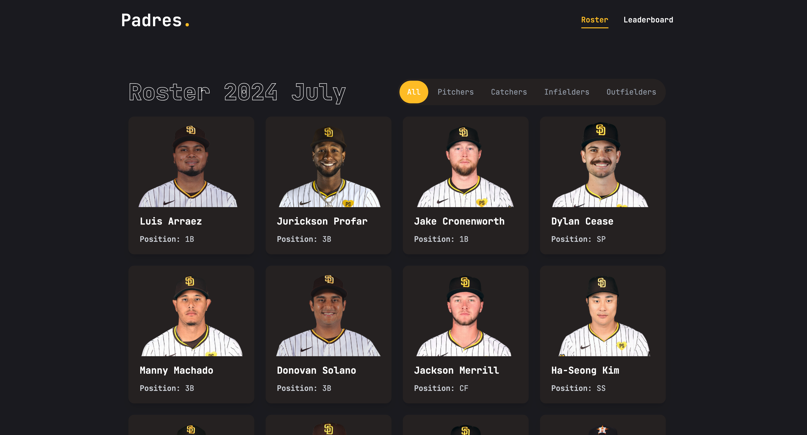

# Padres Project

A full-stack web application for viewing Padres 2024 July baseball statistics using Flask, React, and PostgreSQL.



## Prerequisites

Before you begin, ensure you have the following installed:
- Python 3.8 or higher
- Node.js 18 or higher
- PostgreSQL 13 or higher
- pip (Python package manager)
- npm (Node package manager)

## Quick Start Guide

### 1. Clone the Repository
```bash
git clone https://github.com/yuehcw/padres_project.git
cd padres_project
```

### 2. PostgreSQL Setup

#### First-time PostgreSQL Setup:

1. Download and Install PostgreSQL:
   - Visit [PostgreSQL Downloads](https://www.postgresql.org/download/)
   - Choose your operating system and follow installation instructions
   - During installation, note down the port number (default is 5432)

2. First-time User Setup:
   ```bash
   # For Windows:
   # After installation, search for "SQL Shell (psql)" in Start menu and open it
   # It will prompt for server, database, port, username - press Enter to accept defaults
   
   # For macOS/Linux:
   # Open terminal and run:
   sudo -u postgres psql
   ```

3. Create Your Database and (Optionally) a New User:
   ```sql
   -- Once in psql shell:
   CREATE DATABASE padres_project;
   
   -- Optional: If you want to create a new user
   CREATE USER your_username WITH PASSWORD 'your_password';
   GRANT ALL PRIVILEGES ON DATABASE padres_project TO your_username;
   
   ```

#### If PostgreSQL is already installed:
```bash
# Connect to PostgreSQL
psql -U postgres

# Create database
CREATE DATABASE padres_project;
```

### 3. Database Schema Setup
```sql
-- Run these commands while still in psql:

-- Connect to the newly created database
\c padres_project

-- Now create the tables (still inside psql):

-- Create player_bio table
CREATE TABLE player_bio (
    player_id SERIAL PRIMARY KEY,
    bam_id INTEGER,
    first_name VARCHAR(100) NOT NULL,
    last_name VARCHAR(100) NOT NULL,
    age INTEGER,
    height FLOAT,
    weight FLOAT,
    position VARCHAR(50),
    birth_place VARCHAR(100),
    image_url VARCHAR(255),
    created_at TIMESTAMP DEFAULT CURRENT_TIMESTAMP,
    updated_at TIMESTAMP DEFAULT CURRENT_TIMESTAMP
);

-- Create pitching_info table
CREATE TABLE pitching_info (
    id SERIAL PRIMARY KEY,
    player_id INTEGER REFERENCES player_bio(player_id) NOT NULL,
    first_name VARCHAR(100) NOT NULL,
    last_name VARCHAR(100) NOT NULL,
    game_date DATE,
    game_bam_id INTEGER,
    at_bat_number INTEGER,
    inning INTEGER,
    pitch_seq INTEGER,
    pitch_type VARCHAR(50),
    horz_break FLOAT,
    induced_vert_break FLOAT,
    rel_speed FLOAT,
    pre_outs INTEGER,
    post_outs INTEGER,
    pre_vscore INTEGER,
    post_vscore INTEGER,
    pre_balls INTEGER,
    pre_strikes INTEGER,
    post_balls INTEGER,
    post_strikes INTEGER,
    event_type VARCHAR(100),
    description TEXT,
    spin_rate FLOAT,
    spin_axis FLOAT,
    zone_speed FLOAT,
    plate_x FLOAT,
    plate_z FLOAT,
    extension FLOAT,
    tilt VARCHAR(50),
    hit_exit_speed FLOAT,
    hit_distance FLOAT,
    hit_vertical_angle FLOAT,
    hit_horizontal_angle FLOAT,
    in_play BOOLEAN,
    hit_trajectory VARCHAR(50)
);

-- Create batting_info table
CREATE TABLE batting_info (
    id SERIAL PRIMARY KEY,
    player_id INTEGER REFERENCES player_bio(player_id) NOT NULL,
    first_name VARCHAR(100) NOT NULL,
    last_name VARCHAR(100) NOT NULL,
    game_date DATE,
    game_bam_id INTEGER,
    at_bat_number INTEGER,
    inning INTEGER,
    pitch_seq INTEGER,
    event_type VARCHAR(100),
    description TEXT,
    hit_trajectory VARCHAR(50),
    hit_exit_speed FLOAT,
    hit_vertical_angle FLOAT,
    hit_horizontal_angle FLOAT,
    hit_distance FLOAT,
    hit_bearing FLOAT,
    pre_balls INTEGER,
    pre_strikes INTEGER,
    post_balls INTEGER,
    post_strikes INTEGER,
    pre_vscore INTEGER,
    post_vscore INTEGER,
    pre_basecode INTEGER,
    post_basecode INTEGER,
    pre_r1_bam_id INTEGER,
    pre_r2_bam_id INTEGER,
    pre_r3_bam_id INTEGER,
    post_r1_bam_id INTEGER,
    post_r2_bam_id INTEGER,
    post_r3_bam_id INTEGER,
    swing BOOLEAN,
    contact BOOLEAN,
    in_play BOOLEAN,
    pitch_type VARCHAR(50),
    plate_x FLOAT,
    plate_z FLOAT,
    called_strike BOOLEAN,
    swinging_strike BOOLEAN,
    chase BOOLEAN,
    ball BOOLEAN
);

-- Verify tables were created
\dt

-- Exit psql
\q
```

### 4. Backend Setup
```bash
# Navigate to backend directory
cd backend

# Create virtual environment
python -m venv venv

# Activate virtual environment
# On Windows:
venv\Scripts\activate
# On macOS/Linux:
source venv/bin/activate

# Install dependencies
pip install -r requirements.txt

# Create a new .env file in the root of the backend folder
touch backend/.env  # On macOS/Linux
# OR
type nul > backend/.env  # On Windows

# Add the following content to your backend/.env file:
FLASK_APP=app
FLASK_ENV=development
### If your PostgreSQL has no password:
DATABASE_URL=postgresql://<username>@localhost:5432/padres_project

### If your PostgreSQL has a password:
DATABASE_URL=postgresql://<username>:<password>@localhost:5432/padres_project

# Replace:
# <username> with your PostgreSQL username
# <password> with your PostgreSQL password (if you have one)

# Load data into database
# Navigate to utils directory
cd utils

# Run the data loading scripts in this specific order:
python load_players_info.py
python load_pitching_info.py
python load_batting_info.py

# Start Flask server (from backend root directory)
flask run
```

### 5. Frontend Setup
```bash
# Open a new terminal
# Navigate to frontend directory
cd frontend

# Create .env file in frontend root directory
touch .env  # On macOS/Linux
# OR
type nul > .env  # On Windows

# Add the following content to frontend/.env
VITE_PROXY_URL=http://127.0.0.1:5000  # Points to Flask backend

# Install dependencies
npm install

# Start development server
npm run dev
```

The frontend will start at `http://localhost:5173` (default Vite port)

Note about ports:
- Frontend (Vite) runs on port 5173 by default
- Backend (Flask) runs on port 5000 by default
- If you need to use different ports:
  1. For backend: Set `FLASK_RUN_PORT=your_port` in backend/.env
  2. For frontend: Set `VITE_PORT=your_port` in frontend/.env

## Dependencies

### Backend Dependencies (requirements.txt)
```
alembic==1.14.0
beautifulsoup4==4.12.3
blinker==1.9.0
bs4==0.0.2
certifi==2024.12.14
charset-normalizer==3.4.1
click==8.1.8
Flask==3.0.0
Flask-Cors==5.0.0
Flask-Migrate==4.0.5
Flask-SQLAlchemy==3.1.1
idna==3.10
itsdangerous==2.2.0
Jinja2==3.1.5
Mako==1.3.8
MarkupSafe==3.0.2
numpy==2.2.1
pandas==2.2.2
psycopg2-binary==2.9.10
python-dateutil==2.9.0.post0
python-dotenv==1.0.0
pytz==2024.2
requests==2.32.3
six==1.17.0
soupsieve==2.6
SQLAlchemy==2.0.36
typing_extensions==4.12.2
tzdata==2024.2
urllib3==2.3.0
Werkzeug==3.1.3
```

### Frontend Dependencies (package.json)
```json
{
  "dependencies": {
    "@radix-ui/react-dialog": "^1.1.4",
    "@radix-ui/react-slot": "^1.1.1",
    "class-variance-authority": "^0.7.1",
    "clsx": "^2.1.1",
    "d3": "^7.9.0",
    "lucide-react": "^0.469.0",
    "react": "^18.3.1",
    "react-dom": "^18.3.1",
    "react-icons": "^5.4.0",
    "react-router-dom": "^7.1.1",
    "tailwind-merge": "^2.6.0",
    "tailwindcss-animate": "^1.0.7"
  },
  "devDependencies": {
    "@eslint/js": "^9.17.0",
    "@shadcn/ui": "^0.0.4",
    "@types/react": "^18.3.18",
    "@types/react-dom": "^18.3.5",
    "@vitejs/plugin-react": "^4.3.4",
    "autoprefixer": "^10.4.20",
    "eslint": "^9.17.0",
    "eslint-plugin-react": "^7.37.2",
    "eslint-plugin-react-hooks": "^5.0.0",
    "eslint-plugin-react-refresh": "^0.4.16",
    "globals": "^15.14.0",
    "postcss": "^8.4.49",
    "tailwindcss": "^3.4.17",
    "vite": "^6.0.5"
  }
}
```

## Data Loading

The project requires loading data from CSV files into the database. The data must be loaded in a specific order:

1. First, run `load_players_info.py` to load basic player information
2. Then, run `load_pitching_info.py` to load pitching statistics
3. Finally, run `load_batting_info.py` to load batting statistics

These scripts are located in the `backend/utils` directory. The order is important because later scripts depend on the data loaded by earlier ones.

Required CSV files in `backend/data`:
- padres_project_data.csv
- player_info.csv

## Troubleshooting

### Common Issues

1. **Database Connection Error**
   - Verify PostgreSQL is running
   - Check database credentials in `.env`
   - Ensure database exists
   - Try: `psql -U postgres -h localhost -p 5432 baseball_stats`

2. **Python Dependencies**
   - Verify virtual environment is activated
   - Run `pip install -r requirements.txt` again
   - If psycopg2 fails, try: `pip install psycopg2-binary`

3. **Node Modules**
   - Delete `node_modules` folder and `package-lock.json`
   - Run `npm install` again
   - If vite has issues: `npm clean-install`

4. **Data Loading Issues**
   - Ensure CSV files are in the correct location
   - Check file permissions
   - Verify database connection
   - Check Python pandas version compatibility

### Database Reset

If you need to reset the database:

```bash
psql -U postgres
DROP DATABASE baseball_stats;
CREATE DATABASE baseball_stats;
\q

# Then rerun migrations and load data
flask db upgrade
python load_data.py
```